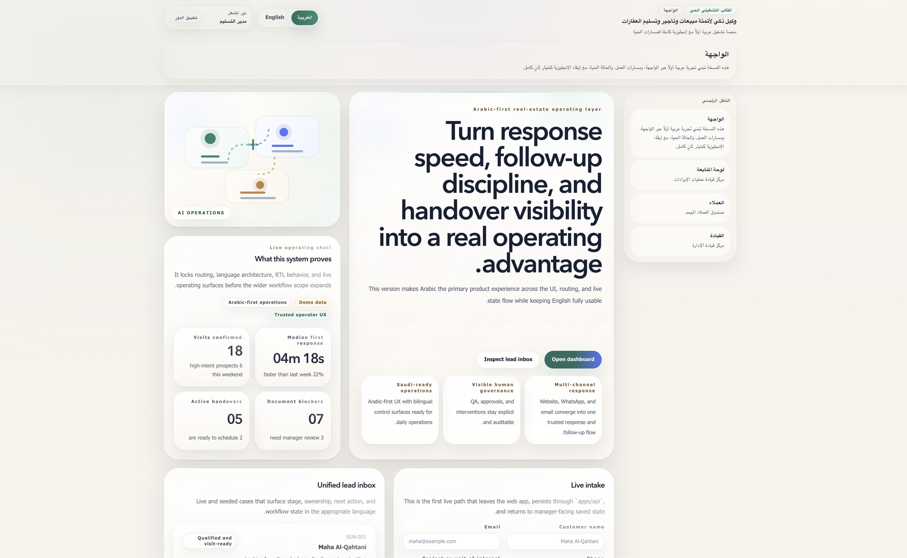

# AI Agent for Automated Real Estate Sales, Leasing & Handover

Premium bilingual real-estate operations software for AI-assisted lead response, qualification, visit scheduling, document readiness, manager oversight, and handover coordination.

<p align="left">
  
  
  
  
  
  
  
  
</p>

## Screenshots



## Overview

This repository contains the product and implementation foundation for a premium real-estate operating layer designed for:

- real-estate developers
- brokerages
- sales teams
- leasing teams
- handover teams
- operations and admin teams
- managers and executive stakeholders

The product is designed for the United States and Saudi Arabia, with English and Arabic as first-class languages. Arabic is treated as a true RTL product experience, not a translated afterthought.

## Product Outcomes

- unify inbound leads across channels
- respond instantly in English and Arabic
- improve qualification quality and follow-up discipline
- increase visit booking throughput
- track document readiness and blockers
- give managers better visibility into performance and stalled cases
- make handover execution visible, structured, and auditable

## Current Repository State

The repository is past bootstrap and currently contains a production-grade Phase 1 demo foundation:

- TypeScript monorepo with `pnpm` workspaces and `turbo`
- Next.js App Router web shell in `apps/web`
- Fastify API foundation in `apps/api`
- shared `contracts`, `database`, and `workflows` backend packages for persisted workflow slices
- shared `domain`, `i18n`, `ui`, and `testing` packages
- English and Arabic locale routing with RTL-aware rendering
- hybrid web routes that fall back to premium seeded demo data when the API is unavailable
- live alpha workflow for website lead intake, qualification, visit scheduling, document tracking, and manager review
- Playwright smoke tests and opt-in visual regression baselines
- integration-tested website lead capture, qualification, visit scheduling, document updates, and manager-readable persisted case APIs
- versioned safe-push verification via `.githooks/pre-push`

Not implemented yet:

- workers and background jobs
- full production PostgreSQL deployment wiring
- authentication and authorization
- provider integrations
- real AI execution and workflow automation
- persisted handover lifecycle beyond the demo shell

## Product Positioning

This product is not positioned as an autonomous deal closer. It is an operational layer that helps teams work faster, with more consistency, auditability, and bilingual quality.

The product promise is operational excellence:

- faster response
- stronger follow-up discipline
- better qualification consistency
- clearer document readiness
- stronger manager visibility
- better handover coordination

## Tech Foundation

- Monorepo: `pnpm` + `turbo`
- Frontend: Next.js App Router + React + TypeScript
- Shared packages: domain, UI, i18n, testing
- Quality gates: ESLint, Vitest, Playwright, safe-push verification
- Planned direction: Fastify API, BullMQ workers, PostgreSQL with Drizzle

## Repository Layout

```text
apps/
  api/                 Fastify API for persisted lead and case workflows
  web/                 Next.js bilingual demo shell
packages/
  contracts/           zod contracts for requests, responses, and case payloads
  database/            Drizzle schema and persisted alpha store
  domain/              product fixtures, domain vocabulary, shared business types
  i18n/                English and Arabic messages and locale helpers
  testing/             shared test routes and browser-test helpers
  ui/                  shared presentation primitives
  workflows/           backend workflow orchestration for lead intake
docs/
  architecture/        repo, domain, and journey planning docs
  i18n/                bilingual and RTL strategy
  local-dev/           Intel MacBook Pro 2019 setup guidance
  roadmap/             phased delivery plan
  testing/             automation and verification strategy
.githooks/             versioned git hooks
scripts/               push verification helpers
```

## Source Of Truth

- Product truth: [`docs/product-spec.md`](docs/product-spec.md)
- Durable repo memory: [`docs/project-state.md`](docs/project-state.md)
- Session instructions: [`AGENTS.md`](AGENTS.md)
- Contribution and push rules: [`CONTRIBUTING.md`](CONTRIBUTING.md)

`docs/_local/current-session.md` is local working memory and is intentionally gitignored.

## Quick Start

### Prerequisites

- Node.js 22 LTS or newer
- `pnpm`
- Git

### Install

```bash
pnpm install
pnpm setup:githooks
```

### Run The Web App

```bash
pnpm dev
```

### Run The API

```bash
pnpm dev:api
```

For the live alpha path, run both the web app and the API. When `apps/api` is not running, the web app keeps falling back to the seeded premium demo routes.

Default local route examples:

- `http://localhost:3000/en`
- `http://localhost:3000/ar`
- `http://localhost:3000/en/dashboard`
- `http://localhost:3000/en/leads`

## Verification

Core verification:

```bash
pnpm typecheck
pnpm lint
pnpm build
pnpm test:fast
pnpm test:integration
pnpm test:web-smoke
```

Visual regression:

```bash
pnpm test:web-visual
pnpm test:web-visual:update
```

Push verification:

```bash
pnpm verify:push
pnpm safe-push -- origin main
```

`pnpm verify:push` now runs typecheck, lint, fast tests, integration tests, and the production build.

## Roadmap Snapshot

- Phase 1A: flagship demo core
- Phase 1B: demo hardening for state quality, responsiveness, and visual coverage
- Phase 2: first persisted workflow for lead capture through manager review
- Phase 3: leasing and document workflows
- Phase 4: handover command center
- Phase 5: enterprise controls and hardening

## Non-Negotiables

- no secrets in the repository
- English and Arabic are both first-class product languages
- Arabic must remain a true RTL experience
- testing matters from the beginning
- the codebase must stay modular, typed, maintainable, and production-grade
- the current demo shell must not be mistaken for real workflow automation
