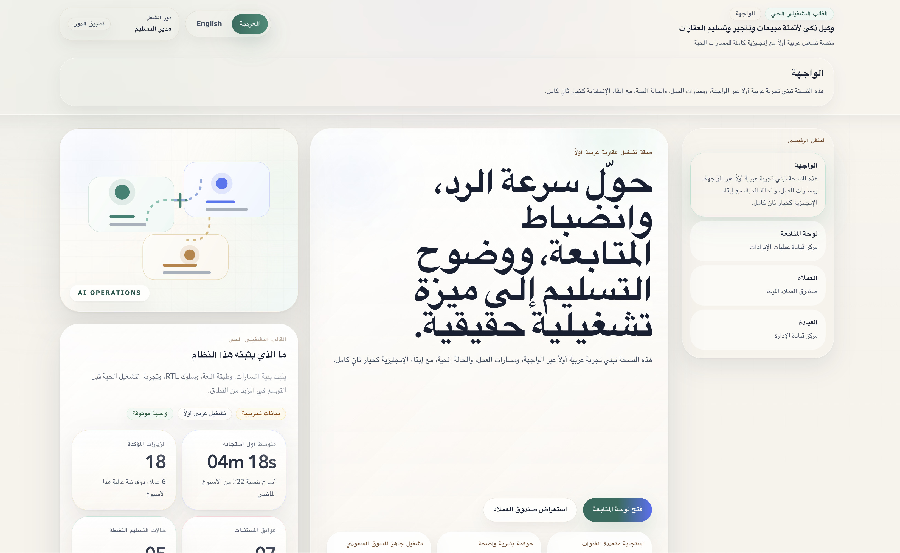
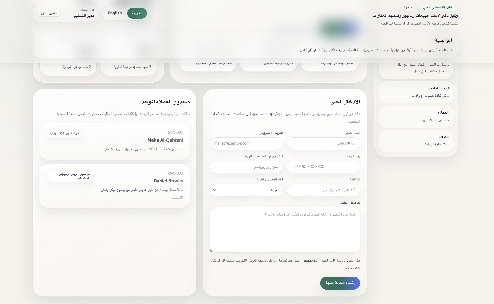

# AI Agent for Automated Real Estate Sales, Leasing & Handover

Premium bilingual real-estate operations software for AI-agent-driven lead response, WhatsApp follow-up, visit scheduling, document readiness, and manager oversight.

<p align="left">
  
  
  
  
  
  
  
  
</p>

## Screenshots




## Overview

This repository currently focuses on a narrower wedge:

- Saudi real-estate developer sales and leasing teams
- bilingual Arabic and English lead response
- WhatsApp as the main live customer communication layer
- manager-visible follow-up, delivery, booking, and document-readiness control

Arabic remains a true RTL product experience, not a translated afterthought.

## Product Outcomes

- capture inbound leads into one queue
- respond quickly in Arabic and English
- keep WhatsApp delivery, inbound replies, and follow-up status visible
- improve qualification quality and visit-booking discipline
- track document readiness and blockers
- give managers better visibility into stalled or failed cases

## Current Repository State

The repository is past bootstrap and currently contains a working local alpha foundation:

- TypeScript monorepo with `pnpm` workspaces and `turbo`
- Next.js App Router web shell in `apps/web`
- Fastify API foundation in `apps/api`
- shared `contracts`, `database`, and `workflows` backend packages for persisted workflow slices
- shared `domain`, `i18n`, `ui`, and `testing` packages
- English and Arabic locale routing with RTL-aware rendering
- hybrid web routes that fall back to premium seeded demo data when the API is unavailable
- live alpha workflow for website lead intake, WhatsApp-first reply orchestration, qualification, visit scheduling, document tracking, and manager review
- production-style `CaseAgentOrchestrator` runtime for `new_lead`, `no_response_follow_up`, and `document_missing`
- provider-backed model adapter boundary with deterministic fallback and scenario-based evaluation coverage
- Playwright smoke tests and opt-in visual regression baselines
- integration-tested website lead capture, WhatsApp webhook handling, qualification, visit scheduling, document updates, and manager-readable persisted case APIs
- versioned safe-push verification via `.githooks/pre-push`

Not implemented yet:

- full production PostgreSQL deployment wiring
- authentication and authorization
- CRM export and sync
- document upload and storage
- production deployment automation around provider secrets and hosting
- broader handover packaging beyond the current local implementation

## Product Positioning

This product is not positioned as an autonomous deal closer. It is an operational layer with a policy-bounded case agent that helps teams work faster, with more consistency, auditability, and bilingual quality.

The product promise is operational excellence:

- faster response
- stronger follow-up discipline
- better qualification consistency
- clearer document readiness
- stronger manager visibility
- clearer WhatsApp delivery and follow-up control

## Tech Foundation

- Monorepo: `pnpm` + `turbo`
- Frontend: Next.js App Router + React + TypeScript
- Shared packages: domain, UI, i18n, testing
- Quality gates: ESLint, Vitest, Playwright, safe-push verification
- Current direction: Fastify API, local persisted worker loop, PGlite + Drizzle for alpha development
- Planned direction: production PostgreSQL, hardened provider deployment, and broader integration coverage

## Repository Layout

```text
apps/
  api/                 Fastify API for persisted lead and case workflows
  web/                 Next.js bilingual demo shell
packages/
  contracts/           zod contracts for requests, responses, and case payloads
  database/            Drizzle schema and persisted alpha store
  domain/              product fixtures, domain vocabulary, shared business types
  i18n/                English and Arabic messages and locale helpers
  testing/             shared test routes and browser-test helpers
  ui/                  shared presentation primitives
  workflows/           backend workflow orchestration for lead intake
docs/
  architecture/        repo, domain, and journey planning docs
  i18n/                bilingual and RTL strategy
  local-dev/           Intel MacBook Pro 2019 setup guidance
  roadmap/             phased delivery plan
  testing/             automation and verification strategy
.githooks/             versioned git hooks
scripts/               push verification helpers
```

## Source Of Truth

- Product truth: [`docs/product-spec.md`](docs/product-spec.md)
- Durable repo memory: [`docs/project-state.md`](docs/project-state.md)
- Session instructions: [`AGENTS.md`](AGENTS.md)
- Contribution and push rules: [`CONTRIBUTING.md`](CONTRIBUTING.md)

`docs/_local/current-session.md` is local working memory and is intentionally gitignored.

## Quick Start

### Prerequisites

- Node.js 22 LTS or newer
- `pnpm`
- Git

### Install

```bash
pnpm install
pnpm setup:githooks
```

### Run The Web App

```bash
pnpm dev
```

### Run The API

```bash
pnpm dev:api
```

### Run The Worker

```bash
pnpm dev:worker
```

For the live alpha path, run both the web app and the API. When `apps/api` is not running, the web app keeps falling back to the seeded premium demo routes.

For the real-channel alpha path, run the worker as well. The API receives website leads and provider webhooks; the worker is responsible for outbound WhatsApp sends and retries.

Default local route examples:

- `http://localhost:3000/en`
- `http://localhost:3000/ar`
- `http://localhost:3000/en/dashboard`
- `http://localhost:3000/en/leads`

## Provider Rollout

Copy `.env.example` into your local environment source and set only the variables you actually need.

This repository is intentionally designed for client-managed integrations:

- you do not need our own Meta or Google production credentials to finish the product implementation
- the code path is already in place for WhatsApp and Google Calendar
- when credentials are absent, the UI and persisted case state now show that the integration is waiting on client credentials instead of pretending the provider is broken

Meta WhatsApp deployment split:

- API owns webhook verification and callback ingestion
- Worker owns outbound WhatsApp sends and retry behavior
- Both services should point at the same persisted store

Recommended Meta configuration:

- `API_META_WHATSAPP_WEBHOOK_VERIFY_TOKEN`: used for the Meta subscription handshake
- `API_META_WHATSAPP_APP_SECRET`: used to validate `x-hub-signature-256` on inbound webhook POSTs
- `WORKER_META_WHATSAPP_ACCESS_TOKEN`: used for outbound sends
- `WORKER_META_WHATSAPP_PHONE_NUMBER_ID`: used for outbound sends
- `WORKER_META_WHATSAPP_API_VERSION`: defaults to `v20.0`

Optional agent-decision provider configuration:

- `WORKER_AGENT_OPENAI_API_KEY`: enables model-backed case-agent decisions in the worker
- `WORKER_AGENT_OPENAI_MODEL`: defaults to `gpt-5.4-mini`
- `WORKER_AGENT_OPENAI_BASE_URL`: defaults to `https://api.openai.com/v1`
- `WORKER_AGENT_OPENAI_TIMEOUT_MS`: request timeout for model calls

If those worker variables are unset, the `CaseAgentOrchestrator` still runs through the deterministic policy adapter. If the provider call fails or returns invalid structured output, the worker falls back to deterministic policy and records the run as a provider fallback mode.

Google Calendar configuration:

- `API_GOOGLE_CALENDAR_ACCESS_TOKEN`
- `API_GOOGLE_CALENDAR_ID`

Rollout sequence:

1. Set API and worker environment variables from `.env.example`.
2. Point the Meta webhook to `POST /v1/integrations/meta/whatsapp/webhook`.
3. Use the same URL for the Meta webhook verification handshake on `GET /v1/integrations/meta/whatsapp/webhook`.
4. Keep `API_META_WHATSAPP_APP_SECRET` set in deployed environments so spoofed callbacks are rejected.
5. Run the worker anywhere outbound sends are expected; without it, cases will queue but WhatsApp replies will not leave the system.

Local or sales-demo mode:

- leave the client-managed provider variables unset
- website lead capture, case progression, QA, documents, and manager visibility still work
- WhatsApp and calendar surfaces will stay truthful by showing that live delivery or sync is awaiting client credentials

## Verification

Core verification:

```bash
pnpm typecheck
pnpm lint
pnpm build
pnpm test:fast
pnpm test:agent-evals
pnpm test:integration
pnpm test:web-smoke
```

Visual regression:

```bash
pnpm test:web-visual
pnpm test:web-visual:update
```

Push verification:

```bash
pnpm verify:push
pnpm safe-push -- origin main
```

`pnpm verify:push` now runs typecheck, lint, fast tests, integration tests, and the production build.

## Roadmap Snapshot

- Phase 1: narrowed product focus around inbox, timeline, manager queue, and documents
- Phase 2: operational MVP with website intake, WhatsApp, qualification, scheduling, and manager visibility
- Phase 3: document workflow depth and storage
- Phase 4: wedge-supporting controls and reporting
- Phase 5: handover as a later add-on

## Non-Negotiables

- no secrets in the repository
- English and Arabic are both first-class product languages
- Arabic must remain a true RTL experience
- testing matters from the beginning
- the codebase must stay modular, typed, maintainable, and production-grade
- provider success must never be implied without confirmation from the provider callback path
